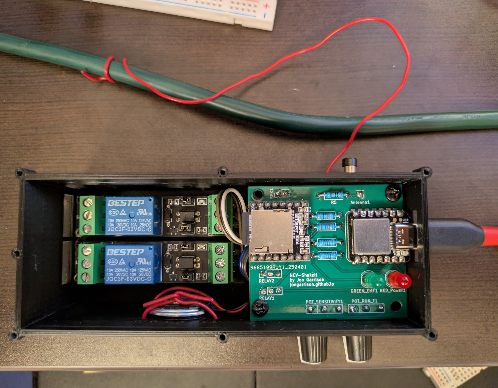
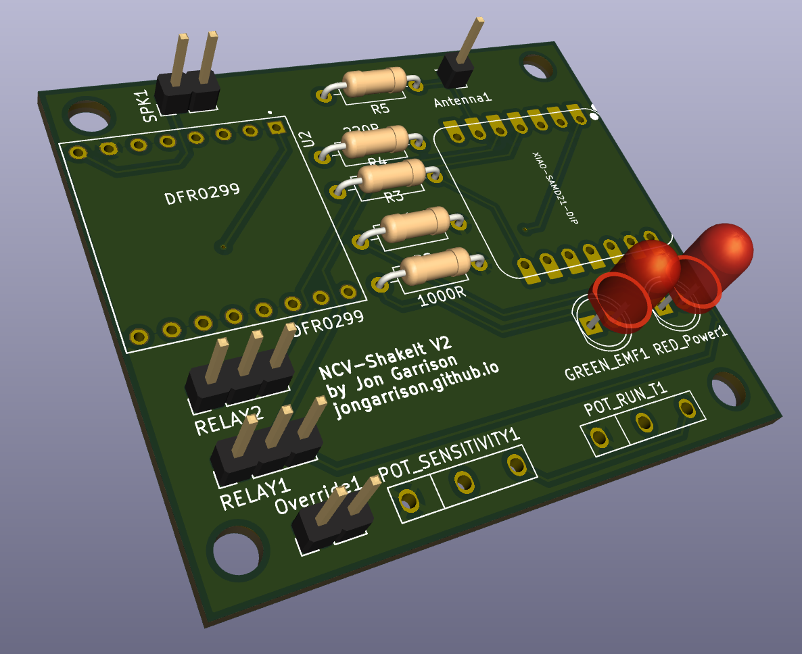
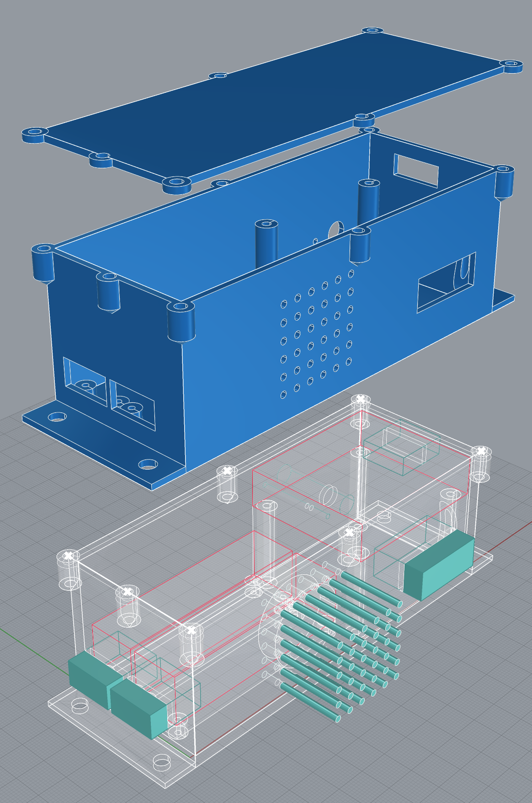

# NCV-ShakeIt
## (Non Contact Voltage Detecting Time Delayed Relay With Audio Feedback)

    

This device is designed to turn on two relays (currently for a single two phase motor) after detecting that another AC device has shut off. The running of the other AC device is detected using a Non-contact Voltage (NCV) detector. When the device is about to trigger the relays, it plays some audio feedback (mp3 files) to let people know the motor is about to run.

Basic functions:
* Device has an antenna for detecting 60hz AC power in a nearby wire. If AC is detected for longer than a minimum threshold the system is ready to trigger when the AC next shuts off. The sensitivity of the AC detection is controlled by a potentiometer knob.
* The device waits for some interval while the main motor system spools down. During this spool down period audio is played to indicate what is happening.
* After the spool down period, two relays are turned on for an interval set by another potentiometer knob. 

# Technical Details

### Non-contact Voltage Detector circuit and algorithm
* Based on this very cool project: https://www.instructables.com/Contactless-AC-Detector/

### PCB Design
* Kicad files are provided in ./PCB_NCV-ShakeIt

    

### Enclosure Design
* Done in Rhino3D Grasshopper. Files found in ./ShakeIt_enclosure

    

### Microcontroller
* [Seeed Xiao SAMD21 board](https://wiki.seeedstudio.com/Seeeduino-XIAO/) - [Pinout](https://wiki.seeedstudio.com/Seeeduino-XIAO/#hardware-overview)

### MP3 Playback - DFPlayer
* [Usage Tips](https://reprage.com/posts/2018-05-08-dfplayer-mini-cheat-sheet/)
